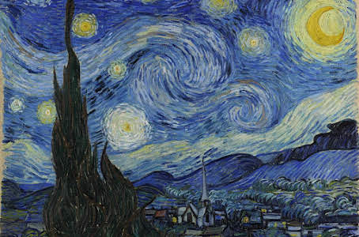
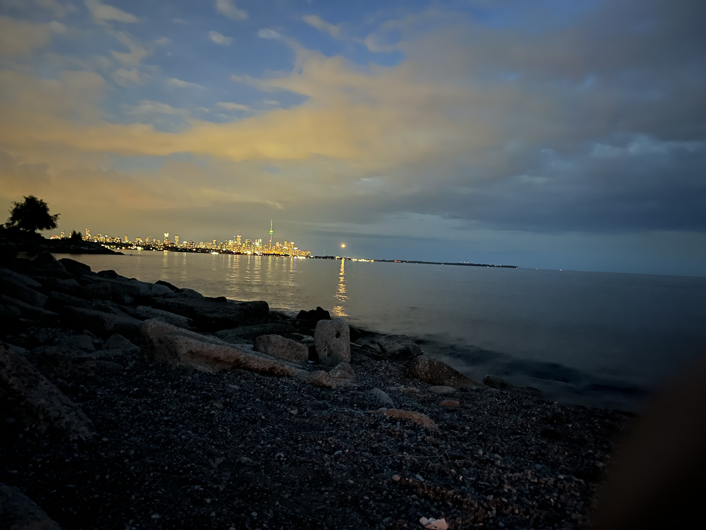
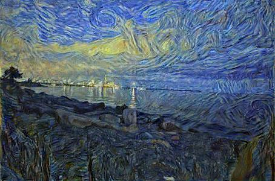

## Neural Style Transfer

#### What is Neural Style Transfer?

Neural Style Transfer (NST) is an algorithm that alters digital images or videos, enabling them to mimic the appearance or visual style of another image. Leveraging deep neural networks, these algorithms transform images. NST finds various applications in creating artificial artwork from photos, such as applying the style of renowned paintings to user-provided images. Artists and designers globally use this technique to craft innovative artwork inspired by diverse styles.
#### How does it work?

For a clear sense of how does the code run, see [NST.ipynb](NST.ipynb) for the Jupyter Notebook.

To use NST, follow the following steps:
#### Usage
0. **Setup**
    ```python
    from NST import image_loader, start_NST, image_display
    ```
1. **Load Images:**
    ```python
    style_img, content_img, input_img = image_loader(style_img_path, content_img_path)
    ```

2. **Run NST:**
    ```python
    output = start_NST(optimizer="lbfgs",
                       content_img=content_img,
                       style_img=style_img,
                       input_img=input_img, num_steps=300,
                       style_weight=1000000)
    ```

3. **Display & Save Output:**
    ```python
    import matplotlib.pyplot as plt
    
    plt.ion()
    image_display(output, title='Output Image', size=(1024, 1024), save=True)
    plt.ioff()
    plt.show()
    ```

#### Example Images
- **Style Image:** 
    
   
- **Content Image:** 
    
   
- **Final Output:** 

   

Feel free to use this NST implementation to explore diverse artistic styles and generate captivating visual outputs.
